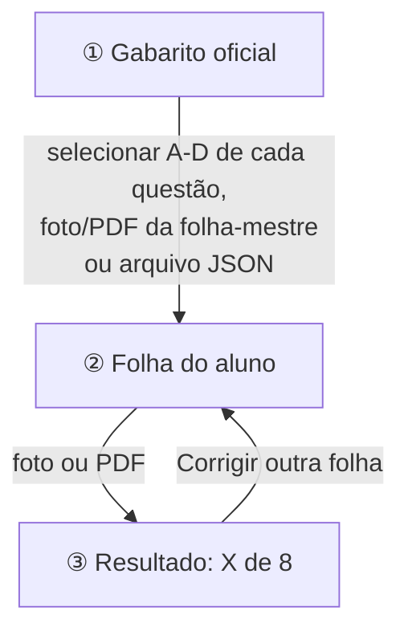

# 1. Como executar

Tudo abaixo foi testado no **Windows 11** com **PowerShell**. Os comandos devem ser rodados dentro da pasta
`trabalhoGabarito`.

## 0. Execução com Docker (Mais Simples)

Se você tem o **Docker Desktop** instalado, não precisa configurar Python, PyTorch ou ambiente virtual na máquina:

```powershell
# Subir a aplicação (constrói a imagem e inicia o serviço)
docker compose up --build

# Para rodar em segundo plano:
# docker compose up -d --build

# Para parar:
# docker compose down
```

O aplicativo estará acessível em **http://localhost:8501**.

> 💡 **Vantagens do Docker:**
> - Os modelos do EasyOCR já são baixados durante o build da imagem, sem espera na primeira execução.
> - Dependências de sistema (OpenMP, bibliotecas do OpenCV, fontes DejaVu) vêm pré-configuradas e isoladas.
> - O PyTorch utiliza versão CPU otimizada, reduzindo o consumo de disco.


## 1.1 Pré-requisitos

| O quê | Por quê |
|---|---|
| **Python 3.12** | Linguagem do projeto |
| ~2 GB livres em disco | O PyTorch (usado pelo OCR) é grande |
| Internet **na primeira execução** | Para instalar as bibliotecas e baixar os modelos do OCR |

### Instalar o Python

```powershell
winget install Python.Python.3.12
```

Feche e abra o terminal depois de instalar. Para conferir:

```powershell
py -3.12 --version
```

> **Armadilha comum no Windows:** digitar só `python` pode abrir a Microsoft Store em vez do Python, porque o
> Windows tem um "atalho falso" chamado `python.exe`. Por isso usamos `py -3.12` na primeira vez e, depois, sempre o
> Python de dentro da `.venv`.

## 1.2 Instalar o projeto (só uma vez)

```powershell
# 1. Criar um ambiente virtual (uma "caixa" com as bibliotecas só deste projeto)
py -3.12 -m venv .venv

# 2. Instalar as bibliotecas listadas em requirements.txt
.\.venv\Scripts\python.exe -m pip install -r requirements.txt
```

O passo 2 demora alguns minutos. As bibliotecas instaladas são:

| Biblioteca | Para que serve no projeto |
|---|---|
| `opencv-python-headless` | Processamento de imagem: ArUco, homografia, limiarização, contornos |
| `numpy` | Imagens são matrizes de números; o NumPy faz as contas |
| `pillow` + `pillow-heif` | Abrir JPG/PNG/HEIC (foto de iPhone) e desenhar a folha |
| `pypdfium2` | Transformar a página de um PDF em imagem |
| `easyocr` (+ PyTorch) | Ler Nome, CPF e RG escritos à mão |
| `streamlit` | Interface web |
| `pytest` | Testes automatizados |

> **Por que não ativamos a `.venv`?** O comando `Activate.ps1` costuma ser bloqueado pela política de execução do
> PowerShell. Chamar `.\.venv\Scripts\python.exe` diretamente funciona sempre e tem o mesmo efeito.

## 1.3 Abrir o aplicativo

```powershell
.\.venv\Scripts\python.exe -m streamlit run app.py
```

O navegador abre sozinho em **http://localhost:8501**. Se não abrir, copie esse endereço. Para parar o app, aperte
`Ctrl + C` no terminal.

> ⏱️ **A primeira correção demora ~20–30 segundos.** O modelo do OCR é carregado na memória na primeira folha de
> aluno (e baixado da internet na primeiríssima vez). As correções seguintes levam 1–3 segundos. **Antes de
> apresentar, corrija uma folha qualquer** para "aquecer" o app.

## 1.4 Usando o app



1. **Gabarito oficial**: escolha uma das formas:
   - **Selecionar alternativas** (padrão, mais rápido): marque a letra certa das 8 questões direto na tela. Uma
     pré-visualização mostra a folha com as marcações antes de confirmar.
   - **Foto ou PDF da folha-mestre**: uma folha preenchida com as respostas certas. Ela precisa ter **exatamente uma
     alternativa bem preenchida por questão**; se não tiver, o app recusa e diz quais questões conferir.
   - **Arquivo JSON**: um arquivo de texto assim:
     ```json
     {"1": "A", "2": "C", "3": "B", "4": "D", "5": "A", "6": "A", "7": "C", "8": "B"}
     ```
2. **Folha do aluno**: envie a foto (JPG, PNG, HEIC) ou o PDF.
3. **Resultado**: nota, Nome/CPF/RG lidos, a réplica da folha com cada questão colorida e, em
   **Ver processamento**, as imagens intermediárias (grade detectada, folha alinhada, arquivo original).

O gabarito oficial fica guardado enquanto a aba estiver aberta; dá para corrigir várias folhas seguidas.
**Recarregar a página (F5) apaga o gabarito**, e ele precisa ser enviado de novo.

### Ajustando a sensibilidade da marcação

No topo da página, o expander **"Ajustes avançados"** tem um controle deslizante que move o `LIMITE_MARCADO`
(capítulo 8.6) sem precisar mexer em código: quanto menor o valor, menos tinta é preciso para um quadrado contar
como "marcado" (útil se alguém usou X em vez de pintar o quadrado inteiro). O valor vale tanto para o gabarito
oficial quanto para a folha do aluno — mude **antes** de enviar as folhas (ou reenvie depois de mudar).

## 1.5 Imprimir e preencher a folha

O app tem o botão **Baixar folha para imprimir** no rodapé. Também dá para gerar pelo terminal:

```powershell
.\.venv\Scripts\python.exe scripts\gerar_folha.py
```

**Na impressão:**
- Papel **A4**. Pode imprimir em "tamanho real" ou "ajustar à página"; a mudança de escala é corrigida pelo software.
- Confira se os **4 quadrados pretos dos cantos** saíram inteiros (sem corte da margem da impressora).

**No preenchimento:**
- Caneta **preta ou azul**. Lápis ou caneta muito clara podem não ser detectados.
- **Preencher o quadrado inteiro.** X, tracinho ou meio preenchido fazem a questão ser anulada (ou lida como em branco).
- Escrever Nome, CPF e RG **dentro** das caixas.

**Na foto:**
- Folha inteira aparecendo, com os 4 marcadores visíveis. Pode estar torta, girada ou de cabeça para baixo.
- Evite reflexo forte (flash) em cima das marcações.

**Escaneando em PDF:** qualquer app de scanner (do celular ou da impressora) serve. O software usa **só a primeira
página** do PDF.

## 1.6 Testar sem imprimir nada

```powershell
.\.venv\Scripts\python.exe scripts\gerar_amostras.py
```

Isso cria em `amostras/sinteticas/` fotos simuladas (tortas, com sombra, de cabeça para baixo, um PDF) e o arquivo
`gabarito_oficial.json`. É só enviar esses arquivos no app.

## 1.7 Rodar os testes automatizados

```powershell
.\.venv\Scripts\python.exe -m pytest           # ~7 segundos
.\.venv\Scripts\python.exe -m pytest -m ocr    # teste do OCR real (mais lento)
```

O resultado esperado é algo como `88 passed, 1 deselected` (o "deselected" é o teste do OCR, que só roda com `-m ocr`).

Para ver **por que** cada parte do algoritmo existe, desligue-a e veja quais testes quebram (nada é alterado nos
arquivos):

```powershell
.\.venv\Scripts\python.exe scripts\experimentos.py                  # lista
.\.venv\Scripts\python.exe scripts\experimentos.py sem_refinamento  # exemplo
```

Mais detalhes no [capítulo 11](11-testes.md).

## 1.8 Avaliar com fotos reais

1. Coloque as fotos/PDFs em `amostras/reais/`.
2. Para cada arquivo `x.jpg`, crie `x.json` com o que deveria ser lido:
   ```json
   {"respostas": {"1": "A", "2": "ANULADA_MULTIPLA", "3": "EM_BRANCO", "4": "C",
                  "5": "D", "6": "B", "7": "ANULADA_AMBIGUA", "8": "A"},
    "nome": "Maria Eduarda Lima", "cpf": "987.654.321-00", "rg": "98.765.432-1"}
   ```
3. Rode:
   ```powershell
   .\.venv\Scripts\python.exe scripts\avaliar.py amostras\reais --saida docs\resultados_reais.md
   ```

## 1.9 Problemas comuns

| Sintoma | Causa provável | Solução |
|---|---|---|
| `python` abre a Microsoft Store | Atalho falso do Windows | Use `py -3.12` ou `.\.venv\Scripts\python.exe` |
| "Não encontrei os cantos … da folha" | Foto cortada, marcador coberto/amassado, ou **folha que não é a do software** (ex.: a folha original do professor, que não tem marcadores) | Refaça a foto com a folha inteira; use a folha gerada pelo app |
| "A folha-mestre precisa de exatamente uma alternativa…" | Alguma questão da folha-mestre está em branco, dupla ou mal preenchida | Abra **Ver processamento** para ver a grade e corrija a folha |
| Mudei o código e o app continua igual | O Streamlit mantém os módulos antigos na memória | Pare com `Ctrl + C` e rode o app de novo |
| `Port 8501 is already in use` | O app já está aberto em outro terminal | Feche o outro ou use `--server.port 8502` |
| Primeira correção muito lenta | Carregando o modelo do OCR | Normal; as próximas são rápidas |
| Nome lido errado, "confiança baixa" | Limitação do OCR com letra de mão (principalmente cursiva) | Esperado; veja o [capítulo 9](09-ocr.md) |
| Marcação feita a lápis não aparece | Traço claro demais | Use caneta; ou baixe a sensibilidade em **Ajustes avançados** (ou os limites no código, capítulo 8) |
| Erro ao instalar o `easyocr`/`torch` | Internet caiu ou pouco espaço | Rode o `pip install` de novo |
