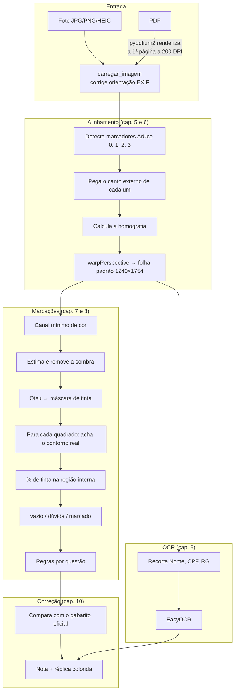
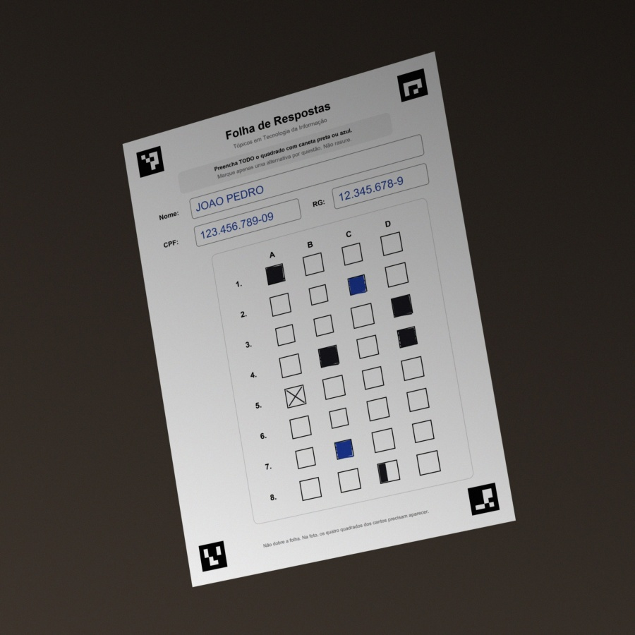
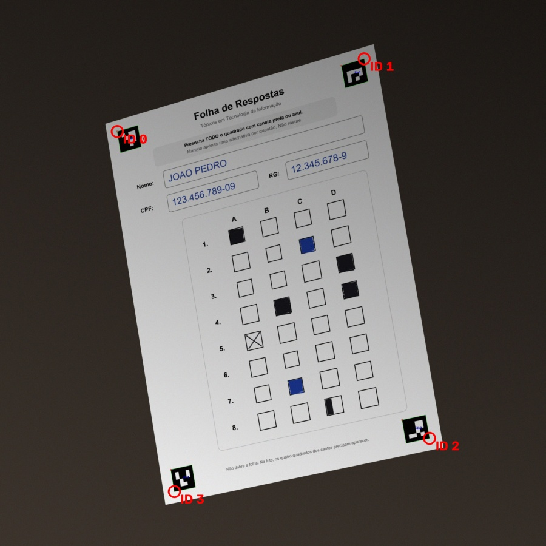
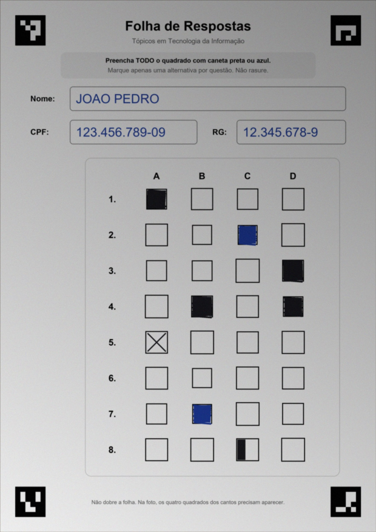
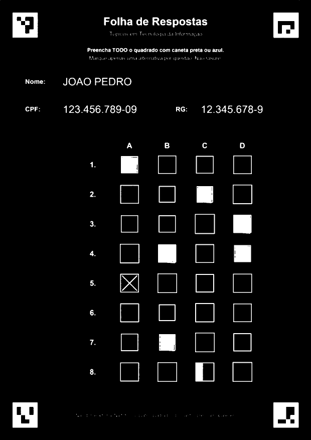
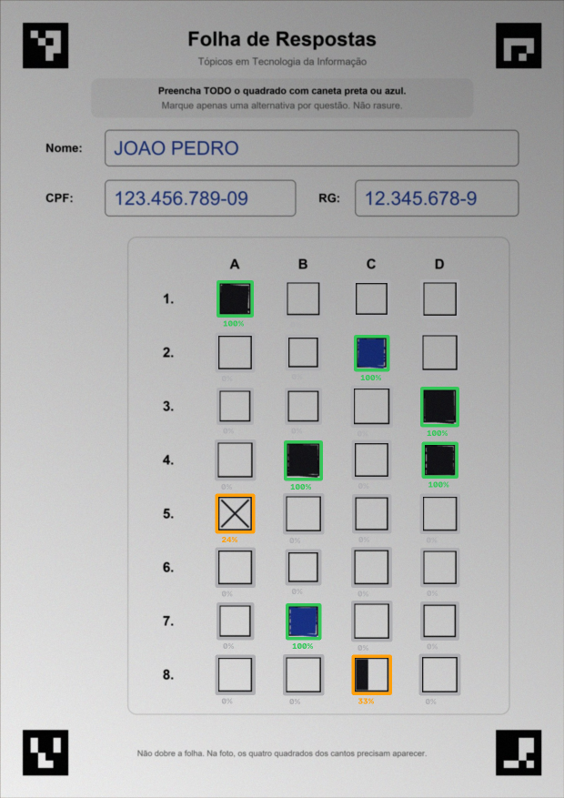

# 2. Visão geral

## 2.1 O problema

O enunciado do professor:

> Fazer um software para ler os gabaritos de uma prova. A prova terá **8 questões**; cada questão terá
> **4 alternativas**; o software deverá dizer **quantas questões foram respondidas corretamente**.

Requisitos combinados depois:

| Requisito | Onde é tratado |
|---|---|
| Anular questão com mais de uma alternativa marcada | [Capítulo 8](08-leitura-das-marcacoes.md) |
| Pedir que o quadrado seja todo preenchido | Instrução impressa na folha ([cap. 4](04-a-folha.md)) + regra de "marcação incompleta" (cap. 8) |
| Ler o nome em letra de forma e em cursiva | [Capítulo 9](09-ocr.md) |
| Funcionar com impressões tortas / quadrados de tamanhos diferentes | Capítulos [5](05-marcadores-aruco.md), [6](06-homografia.md) e 8 |
| Apresentar funcionando e dizer o que deu certo e o que não deu | [apresentacao.md](apresentacao.md), [resultados.md](resultados.md) |

Este tipo de sistema tem nome: **OMR** (*Optical Mark Recognition*, reconhecimento óptico de marcas). É a mesma ideia
das folhas de resposta do ENEM e de concursos.

## 2.2 A ideia central

Um computador não "vê" uma folha. Ele recebe **uma matriz de números** (capítulo 3). O desafio é responder, só com
contas nesses números, perguntas como "o quadrado B da questão 3 está pintado?".

A pergunta fica fácil se soubermos **exatamente em que pixels** está cada quadrado. Numa foto de celular isso muda
toda vez: a folha aparece girada, inclinada, maior ou menor, com sombra. Então a estratégia é:

1. **Colocar referências conhecidas na folha** (os marcadores ArUco nos cantos).
2. **Achar essas referências na foto** e, a partir delas, **transformar a foto numa folha "padrão"**, reta e sempre do
   mesmo tamanho (homografia).
3. Na folha padrão, cada quadrado **está sempre no mesmo lugar**, e basta medir quanto dele está pintado.

É como encaixar um molde transparente em cima da folha: primeiro alinhamos o molde pelos cantos, depois olhamos
cada janelinha.

## 2.3 O caminho completo



A mesma sequência, com as imagens reais que o programa produz:

| Etapa | Imagem |
|---|---|
| Foto recebida |  |
| Marcadores encontrados (círculo vermelho = canto externo usado) |  |
| Folha alinhada |  |
| Máscara de tinta (branco = tinta) |  |
| Grade detectada (verde = marcado, laranja = dúvida, cinza = vazio) |  |

## 2.4 Mapa do código

Cada arquivo tem **uma responsabilidade**. Isso facilita testar e explicar cada parte separadamente.

```
trabalhoGabarito/
├── app.py                  ← interface (Streamlit)
├── estilo.css              ← visual da interface
├── gabarito/               ← o "motor": não depende da interface
│   ├── layout.py           ← ONDE fica cada coisa na folha (coordenadas)
│   ├── folha.py            ← DESENHA a folha (PNG/PDF)
│   ├── alinhamento.py      ← abre o arquivo, acha ArUco, faz a homografia
│   ├── marcacoes.py        ← máscara de tinta, % de preenchimento, regras
│   ├── ocr.py              ← lê Nome/CPF/RG
│   ├── leitura.py          ← ler_folha(): junta alinhamento + marcações + OCR
│   ├── correcao.py         ← gabarito oficial e nota
│   ├── visualizacao.py     ← imagem "grade detectada"
│   ├── interface_html.py   ← HTML do resultado (placar, réplica da folha)
│   ├── modelos.py          ← estruturas de dados (Questao, Resultado...)
│   └── sintetico.py        ← gera folhas e fotos falsas para testes (e a pré-visualização do gabarito manual)
├── scripts/                ← ferramentas de linha de comando
├── tests/                  ← testes automatizados (pytest)
├── amostras/               ← imagens de exemplo
└── docs/                   ← você está aqui
```

A função mais importante é `ler_folha` (`gabarito/leitura.py`), que resume o pipeline em poucas linhas:

```python
def ler_folha(imagem_bgr, ocr=None):
    alinhada = alinhar(imagem_bgr)                 # cap. 5 e 6
    questoes = tuple(ler_marcacoes(alinhada))      # cap. 7 e 8
    identificacao, erro_ocr = None, None
    if ocr is not None:
        try:
            identificacao = ocr(alinhada)          # cap. 9
        except Exception as erro:
            erro_ocr = f"Não foi possível ler Nome/CPF/RG: {erro}"
    return LeituraFolha(questoes, alinhada, identificacao, erro_ocr)
```

Repare que um erro no OCR **não impede a correção**: a nota é o objetivo principal, e o nome é um extra.

## 2.5 Glossário rápido

| Termo | Significado |
|---|---|
| **Pixel** | Menor "quadradinho" de uma imagem; guarda números de cor |
| **Folha padrão** | A folha depois de endireitada: sempre 1240 × 1754 pixels |
| **ArUco** | Marcador quadrado preto e branco que o computador reconhece e identifica por número |
| **Homografia** | Transformação que "desentorta" uma imagem de um plano visto em perspectiva |
| **Máscara** | Imagem só com 0 e 255 indicando onde há algo (aqui: tinta) |
| **Limiarização** | Transformar tons de cinza em preto e branco usando um valor de corte (limiar) |
| **Otsu** | Método que escolhe o limiar automaticamente |
| **Morfologia** | Operações que alteram formas na imagem (dilatação, erosão) |
| **Contorno** | Sequência de pixels que forma a borda de uma região |
| **OCR** | Reconhecimento óptico de caracteres: transformar imagem de texto em texto |
| **TDD** | Desenvolvimento guiado por testes: escreve o teste antes do código |
