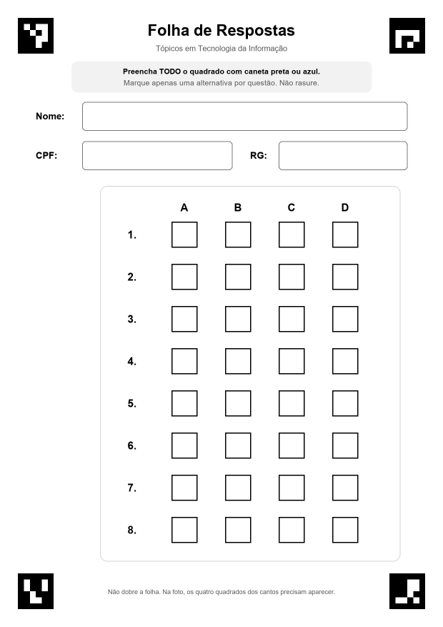
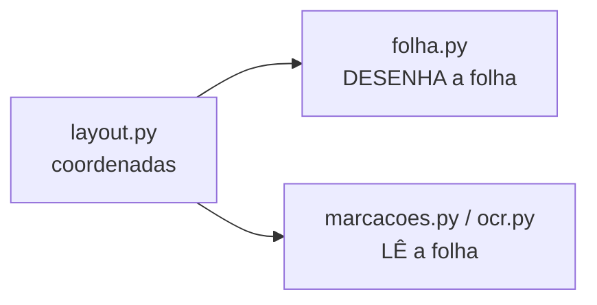

# 4. A folha de respostas

## Teoria: controlar a entrada simplifica o problema

Em visão computacional, **quanto mais controle temos sobre o que vai ser fotografado, mais simples e confiável fica o
algoritmo**. As folhas do ENEM têm marcas de alinhamento pretas nas bordas pelo mesmo motivo.

O professor deixou o layout livre. Com isso, em vez de tentar adivinhar onde estão os quadradinhos em qualquer folha,
**desenhamos a nossa**, com três vantagens:

1. **Marcadores de referência** nos cantos, fáceis de achar em qualquer foto (capítulo 5).
2. **Posições conhecidas**: o programa sabe, ao pixel, onde está cada quadrado.
3. **Instruções impressas** que orientam o aluno a preencher do jeito que o algoritmo lê melhor.



## Como aplicamos

### 4.1 Uma única fonte da verdade: `layout.py`

O arquivo `gabarito/layout.py` define **todas as coordenadas** da folha, no espaço da folha padrão (1240 × 1754 px,
150 DPI). Ele é usado por **dois lados**:



Se alguém mudar o tamanho de um quadrado, o desenho e a leitura mudam juntos, e as coordenadas nunca ficam
"desencontradas". Isso evita uma classe inteira de erros.

Exemplo: a posição de qualquer quadrado é calculada, não copiada à mão:

```python
CELULA_LADO = 72        # lado do quadrado (≈ 12,2 mm)
GRADE_X0, GRADE_Y0 = 480, 620   # canto superior esquerdo do quadrado 1-A
PASSO_X, PASSO_Y = 150, 118     # distância entre colunas e entre linhas

def celula(questao, alternativa):
    linha = questao - 1
    coluna = ALTERNATIVAS.index(alternativa)   # A=0, B=1, C=2, D=3
    return Rect(GRADE_X0 + coluna * PASSO_X, GRADE_Y0 + linha * PASSO_Y, CELULA_LADO, CELULA_LADO)
```

Por exemplo, `celula(3, "C")` = `Rect(x = 480 + 2·150, y = 620 + 2·118, 72, 72)` = `Rect(780, 856, 72, 72)`.

### 4.2 Os elementos da folha

| Elemento | Posição / tamanho (folha padrão) | Por quê |
|---|---|---|
| 4 marcadores ArUco | 100 × 100 px (≈17 mm), a 50 px (≈8,5 mm) da borda | Grandes o bastante para aparecer em foto de longe; longe da borda para não serem cortados pela impressora |
| Instruções | Caixa cinza no topo | "Preencha TODO o quadrado com caneta preta ou azul. Marque apenas uma alternativa por questão. Não rasure." |
| Nome, CPF, RG | Caixas de 80 px de altura com borda cinza | Espaço para letra de mão; na leitura, o recorte descarta 8 px de cada lado para a borda não entrar no OCR |
| Grade 8 × 4 | Quadrados de 72 px, bordas pretas | Mantém o formato da folha do professor |
| Rodapé | "Na foto, os quatro quadrados dos cantos precisam aparecer" | Orienta quem fotografa |

### 4.3 Regras de projeto verificadas por testes

Algumas decisões do layout são **restrições** que, se quebradas, estragam a leitura. Por isso elas viraram testes
automáticos em `tests/test_layout.py`:

1. **As janelas de busca não se sobrepõem.** Na leitura, cada quadrado é procurado numa janela 30% maior que ele
   (capítulo 8). Com 72 px de lado, a janela tem 72 + 2·22 = 116 px. Por isso o passo entre linhas é 118 px e não
   menos: se as janelas se sobrepusessem, o programa poderia "achar" o quadrado da questão vizinha.
2. **Nada encosta nos marcadores.** O ArUco precisa de uma **zona de silêncio** branca em volta para ser detectado.

> **Um caso real que o teste pegou:** na primeira versão, a moldura cinza da grade e o texto do rodapé encostavam no
> marcador inferior direito, e ele **deixou de ser detectado**. A falha apareceu no teste da folha; criamos o teste da
> "zona de silêncio" e reorganizamos o layout. É um bom exemplo de por que testar o layout vale a pena.

### 4.4 Desenhando a folha: `folha.py`

A folha é desenhada com a biblioteca **Pillow** (formas e texto) e o **OpenCV** (marcadores):

```python
marca = cv2.aruco.generateImageMarker(dicionario, id_marcador, r.w * s)   # gera o desenho do ArUco
img.paste(Image.fromarray(marca).convert("RGB"), (r.x * s, r.y * s))    # cola na posição do layout
...
d.rectangle(_escalar(layout.celula(questao, alternativa), s), outline=PRETO, width=3 * s)  # quadrado
```

- `escala = 1` desenha na folha padrão (150 DPI), usada nos testes.
- `escala = 2` desenha a 300 DPI para impressão; o PDF é salvo com `resolution=300`, e assim a página sai exatamente
  em tamanho A4.
