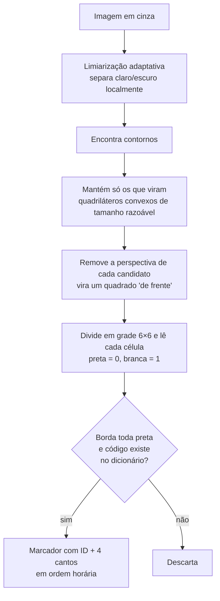

# 5. Marcadores ArUco: achando os cantos da folha

## Teoria

### 5.1 Marcadores fiduciais

Um **marcador fiducial** é um desenho feito para ser **fácil de encontrar e identificar** por um computador. O QR Code
é o exemplo mais conhecido. Em visão computacional e realidade aumentada usam-se muito o **ArUco** e o **AprilTag**,
porque são simples, rápidos e dizem **exatamente onde estão seus 4 cantos**.

Precisamos de duas informações sobre cada canto da folha:
- **onde** ele está na foto (coordenadas em pixels);
- **qual** canto ele é (superior esquerdo? inferior direito?).

O ArUco resolve as duas.

### 5.2 Como um ArUco é construído

Usamos o dicionário **`DICT_4X4_50`**: **4 × 4 bits** internos e **50 marcadores diferentes** (IDs 0 a 49).

```
 ┌───┬───┬───┬───┬───┬───┐
 │ ■ │ ■ │ ■ │ ■ │ ■ │ ■ │   ← borda preta (1 célula)
 ├───┼───┼───┼───┼───┼───┤
 │ ■ │ □ │ ■ │ □ │ □ │ ■ │
 ├───┼───┼───┼───┼───┼───┤
 │ ■ │ ■ │ □ │ □ │ ■ │ ■ │   ← 4 × 4 = 16 bits
 ├───┼───┼───┼───┼───┼───┤     (□ = 1 branco, ■ = 0 preto)
 │ ■ │ □ │ □ │ ■ │ □ │ ■ │     formam o "código" do ID
 ├───┼───┼───┼───┼───┼───┤
 │ ■ │ ■ │ □ │ ■ │ ■ │ ■ │
 ├───┼───┼───┼───┼───┼───┤
 │ ■ │ ■ │ ■ │ ■ │ ■ │ ■ │   ← borda preta
 └───┴───┴───┴───┴───┴───┘
     (padrão ilustrativo)
```

- A **borda preta** torna o quadrado fácil de achar.
- Os **16 bits de dentro** formam o código. Os padrões do dicionário foram escolhidos para serem **bem diferentes
  entre si, inclusive quando girados**. A diferença é medida pela **distância de Hamming** (quantos bits mudam).
  Isso traz duas consequências:
  - se alguns bits forem lidos errado (sombra, desfoque), o detector ainda identifica o marcador correto ou descarta a
    leitura, em vez de confundir IDs;
  - como o padrão **não é simétrico**, o detector descobre **a rotação**: sabe qual canto é o "superior esquerdo do
    marcador", mesmo com a foto de cabeça para baixo.

### 5.3 Como o detector encontra os marcadores

O `cv2.aruco.ArucoDetector` faz, resumidamente:



A saída é, para cada marcador, o **ID** e os **4 cantos** em **ordem horária, começando pelo canto superior esquerdo do
próprio marcador**. É essa ordem que nos deixa descobrir a orientação da folha.

## Como aplicamos

### 5.4 Um ID para cada canto

Na folha, cada canto recebe um marcador com ID fixo:

```
 ID 0 ●─────────────────● ID 1
      │                 │
      │     folha       │
      │                 │
 ID 3 ●─────────────────● ID 2
```

(● = canto **externo** do marcador, o mais próximo da quina do papel)

Detalhe que simplifica muito o código: os cantos do ArUco vêm em ordem horária `[0]=sup-esq, [1]=sup-dir,
[2]=inf-dir, [3]=inf-esq` do próprio marcador. Com os marcadores impressos "em pé", o **canto externo do marcador de
ID i é justamente o canto de índice i**:

```python
# canto externo do marcador i é o seu canto de índice i (ver layout.py)
encontrados[id_marcador] = c.reshape(4, 2)[id_marcador] / fator
```

Como o índice é **do marcador**, e não da foto, isso continua valendo com a folha girada ou de cabeça para baixo.


*Contorno verde: marcador detectado. Círculo vermelho: canto externo usado na homografia.*

### 5.5 Detalhes de robustez

| Detalhe | Código | Por quê |
|---|---|---|
| **Reduzir fotos grandes** | Lado maior ≤ 2000 px na detecção; as coordenadas são multiplicadas de volta | Fotos de celular têm 4000 px ou mais; detectar em tamanho menor é mais rápido e, em geral, mais estável |
| **Segunda tentativa** | Se faltar marcador, detecta de novo na resolução original | Marcadores muito pequenos na foto podem sumir na redução |
| **Refinamento subpixel** | `CORNER_REFINE_SUBPIX` | Posição do canto com precisão melhor que 1 pixel, e homografia mais exata |
| **Mensagem útil** | `MarcadoresNaoEncontrados(faltando=[2, 3])` → "Não encontrei os cantos inferior direito e inferior esquerdo" | O usuário sabe o que refazer |

### 5.6 Por que não algo mais simples?

Consideramos três abordagens antes de programar:

| Abordagem | Vantagem | Por que não escolhemos |
|---|---|---|
| **A) ArUco** ✅ | Identifica **qual** canto é qual; robusto a rotação e iluminação | — |
| B) Quadrados pretos simples | Visualmente mais simples | Todos os quadrados são iguais: a orientação precisa ser "adivinhada" pela posição, o que falha com a folha muito girada ou de cabeça para baixo. Sombras e textos pretos geram falsos positivos |
| C) Sem marcadores (achar a borda do papel e a grade) | Funciona com a folha original do professor | Muito sensível a fundo claro, sombra, folha dobrada; muito mais código de detecção |

**Limitação assumida:** se um marcador sair cortado ou coberto na foto, a folha não é lida, e o app pede outra foto.
Por isso a **folha original do professor** (sem marcadores) não é aceita.
