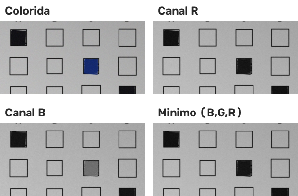
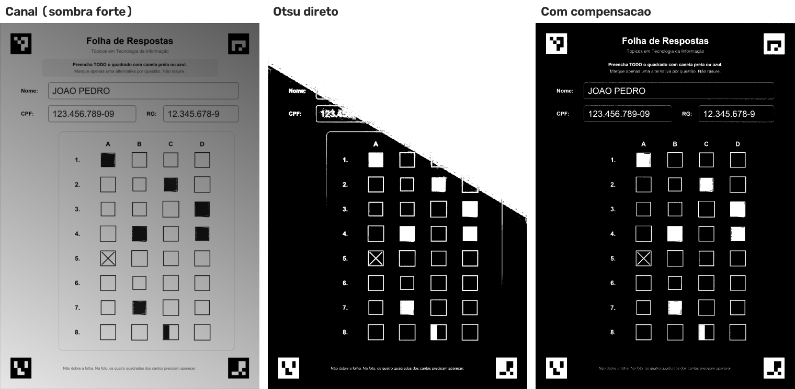
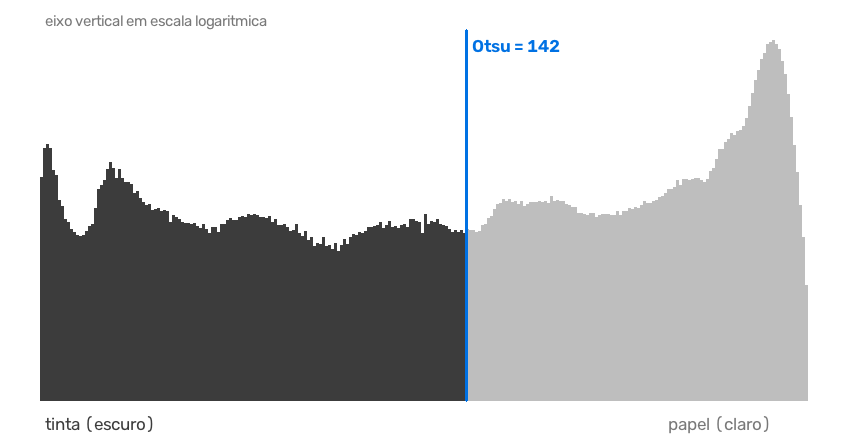
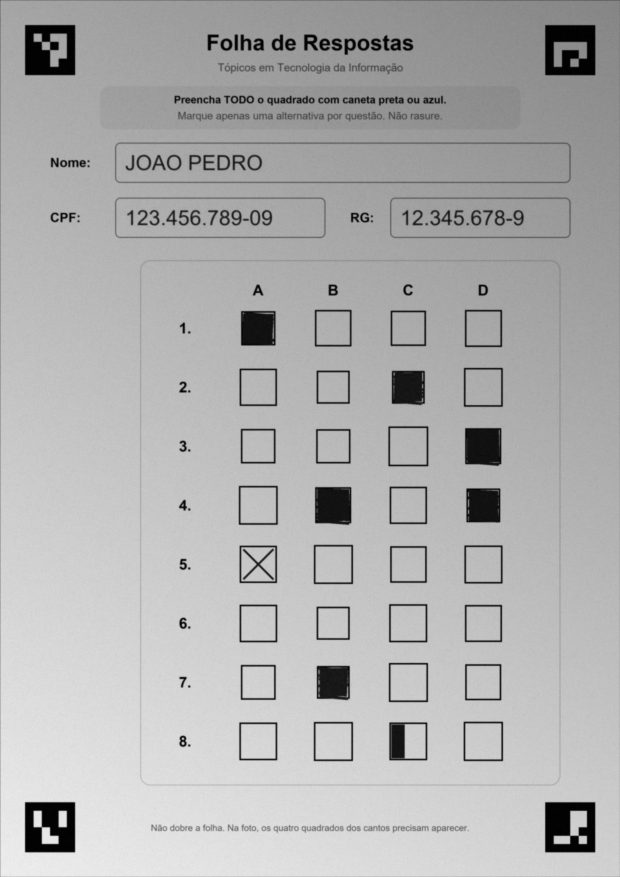
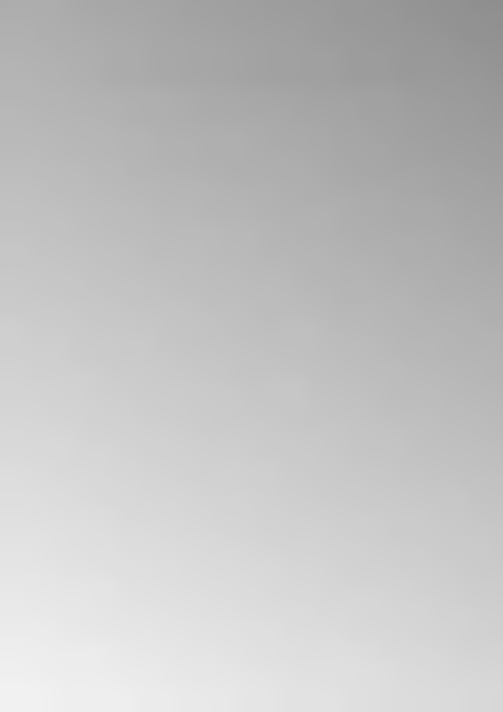
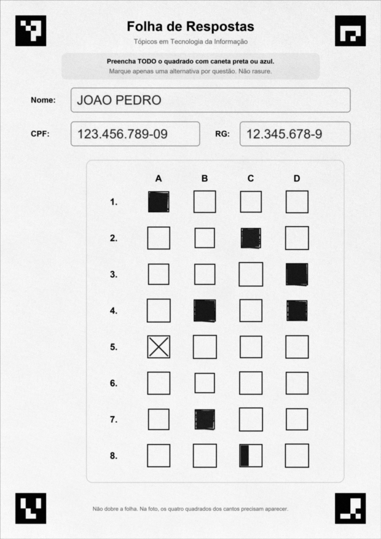

# 7. Segmentação da tinta: separando tinta de papel

**Segmentar** é dividir a imagem em regiões com significado. Aqui queremos a divisão mais simples possível: cada
pixel é **tinta** ou **papel**. O resultado é uma **máscara**, uma imagem onde `255` (branco) = tinta e `0`
(preto) = papel.

Parece fácil ("escuro é tinta"), mas três problemas aparecem na prática:
1. **Cor**: tinta azul não é tão escura quanto a preta.
2. **Sombra**: papel na sombra pode ficar mais escuro que tinta no sol.
3. **Onde cortar**: qual valor separa "escuro" de "claro"?

## Teoria

### 7.1 Problema 1: cor. Usar o menor canal

A conversão comum para cinza (`0,299·R + 0,587·G + 0,114·B`) dá peso **pequeno ao azul**. Resultado: tinta azul
clara vira um cinza médio, perigosamente perto do papel. Uma ideia melhor para **achar tinta** é usar o **menor valor
entre R, G e B**:

- **papel branco** é claro em **todos** os canais, então o mínimo continua alto;
- **qualquer tinta colorida** é escura em **pelo menos um** canal, então o mínimo fica baixo.

| Cor | R, G, B | Cinza ponderado | **Mínimo** |
|---|---|---|---|
| Papel branco | 235, 235, 235 | 235 | **235** |
| Papel amarelado | 240, 230, 200 | 230 | **200** |
| Caneta preta | 25, 25, 30 | 25 | **25** |
| Caneta azul | 30, 60, 160 | 62 | **30** |
| Caneta azul clara | 90, 140, 230 | 135 | **90** |
| Caneta vermelha | 200, 30, 40 | 82 | **30** |

A caneta azul clara passa de 135 (ambíguo) para 90 (claramente tinta).



*Na imagem colorida há uma marcação preta e uma azul. No **canal B** a azul fica clara, quase some. No **canal R** ela
fica escura. O **mínimo** fica escuro para as duas.*

### 7.2 Problema 2: iluminação desigual

**Limiarização global** usa um único valor de corte para a imagem inteira: `pixel < limiar → tinta`. Com sombra, não
existe um valor que funcione em todo lugar:

```
                       lado iluminado     lado na sombra
 papel                      240               120
 tinta                       80                40
```

Um limiar de 100 marca como tinta o papel da sombra? Não (120 > 100). Um limiar de 130? Marca (120 < 130). E um
limiar de 70 perde a tinta do lado iluminado (80 > 70). **Não há limiar global que separe as duas colunas.** A figura
mostra o que acontece numa foto com sombra forte:



*Esquerda: canal com sombra forte. Meio: **Otsu direto**, e 37% da folha vira "tinta" (o triângulo branco é a região
na sombra). Direita: **com compensação**, só 5%, que é a tinta de verdade.*

### 7.3 A solução: estimar o fundo e dividir

Se soubermos **como seria o papel sem tinta** em cada ponto (o "fundo"), basta **dividir**:

```
normalizada = canal / fundo × 255
```

No exemplo da tabela acima:

| | Canal | Fundo (papel ali) | Normalizada |
|---|---|---|---|
| Papel no sol | 240 | 240 | 240/240 × 255 = **255** |
| Tinta no sol | 80 | 240 | 80/240 × 255 = **85** |
| Papel na sombra | 120 | 120 | 120/120 × 255 = **255** |
| Tinta na sombra | 40 | 120 | 40/120 × 255 = **85** |

A sombra **desaparece**: a sombra multiplica tudo por um fator, e a divisão cancela esse fator. (Em fotografia isso
se chama *flat-field correction*.)

A questão passa a ser: **como estimar o fundo** se a folha está cheia de tinta? Com **morfologia**.

### 7.4 Morfologia: dilatação

Operações morfológicas passam uma **janela** (o *elemento estruturante*) por cima da imagem. As duas básicas, em tons
de cinza:

- **Dilatação**: cada pixel recebe o **maior** valor dentro da janela. Regiões **claras crescem**.
- **Erosão**: cada pixel recebe o **menor** valor dentro da janela. Regiões **escuras crescem**.

(Nas aulas vimos as duas em imagens binárias, com `imdilate`/`imerode`; em cinza a ideia é a mesma, com máximo e
mínimo.)

Exemplo em uma linha de pixels, dilatação com janela de 3:

```
 original:   240  240   60   50  240  240
 dilatada:   240  240  240  240  240  240
```

O traço escuro (60, 50) tinha 2 pixels, menos que a janela, e **sumiu**. Sobrou só o papel. Mas atenção: se a mancha
de tinta for **maior que a janela**, o meio dela sobrevive. Por isso **a janela precisa ser maior que a maior mancha de
tinta**.

Depois da dilatação aplicamos um **desfoque gaussiano**, que suaviza a estimativa (a dilatação deixa um aspecto de
"blocos").

### 7.5 Problema 3: onde cortar. O método de Otsu

Depois de normalizar, o histograma (quantos pixels existem de cada valor) tem **dois morros**: um de tinta (escuro)
e um de papel (claro). O **método de Otsu** escolhe automaticamente o limiar que **melhor separa os dois grupos**.

Para cada limiar possível `t`, divide os pixels em dois grupos e calcula a **variância entre classes**:

```
σ²_entre(t) = ω₀ · ω₁ · (μ₀ − μ₁)²
```

- `ω₀`, `ω₁` = fração de pixels em cada grupo
- `μ₀`, `μ₁` = média de cada grupo

O melhor `t` é o que **maximiza** esse valor: grupos com médias bem distantes e ambos com tamanho relevante.

**Exemplo com 10 pixels:** `20, 25, 30, 200, 210, 215, 220, 225, 230, 235`

| Corte | Grupo escuro | Grupo claro | ω₀ · ω₁ · (μ₀ − μ₁)² |
|---|---|---|---|
| entre 25 e 30 | 20, 25 → μ₀ = 22,5 | 8 pixels → μ₁ = 195,6 | 0,2 · 0,8 · 173,1² ≈ **4.796** |
| **entre 30 e 200** | 20, 25, 30 → μ₀ = 25 | 7 pixels → μ₁ = 219,3 | 0,3 · 0,7 · 194,3² ≈ **7.927** ✅ |
| entre 200 e 210 | 4 pixels → μ₀ = 68,75 | 6 pixels → μ₁ = 222,5 | 0,4 · 0,6 · 153,75² ≈ **5.673** |

O corte entre 30 e 200 vence, que é exatamente o que um humano faria olhando os números.



*Histograma da folha normalizada do exemplo. O Otsu escolheu 142. À esquerda (escuro): tinta, texto impresso,
bordas. À direita: papel. O eixo vertical está em escala logarítmica, porque há muito mais papel que tinta.*

## Como aplicamos

Tudo acontece em `etapas_mascara` (`gabarito/marcacoes.py`):

```python
KERNEL_FUNDO = 101                  # janela da dilatação (px)
LIMIAR_MIN, LIMIAR_MAX = 100, 200   # faixa permitida para o limiar

def etapas_mascara(folha_bgr):
    canal = folha_bgr.min(axis=2)                                      # 7.1 menor canal
    kernel = cv2.getStructuringElement(cv2.MORPH_RECT, (KERNEL_FUNDO, KERNEL_FUNDO))
    fundo = cv2.GaussianBlur(cv2.dilate(canal, kernel), (0, 0), 15)    # 7.4 fundo
    normalizada = cv2.divide(canal, np.maximum(fundo, 1), scale=255)   # 7.3 divisão
    limiar_otsu, _ = cv2.threshold(normalizada, 0, 255, cv2.THRESH_BINARY + cv2.THRESH_OTSU)  # 7.5
    limiar = float(np.clip(limiar_otsu, LIMIAR_MIN, LIMIAR_MAX))
    mascara = np.where(normalizada < limiar, 255, 0).astype(np.uint8)
    ...
```

| Etapa | Imagem |
|---|---|
| Canal mínimo |  |
| Fundo estimado (dilatação 101×101 + desfoque): a tinta sumiu e sobrou a iluminação |  |
| Normalizada (canal ÷ fundo): papel uniforme |  |
| Máscara final (Otsu) |  |

### Por que esses números?

| Valor | Justificativa |
|---|---|
| **Janela de 101 × 101 px** | O maior borrão de tinta esperado é um quadrado todo preenchido: 72 × 72 px. A janela precisa ser maior (seção 7.4). 101 é ímpar (tem centro) e dá folga para rabiscos que saem do quadrado |
| **Desfoque σ = 15** | Suaviza os "degraus" da dilatação sem apagar variações reais de luz, que são lentas |
| **`np.maximum(fundo, 1)`** | Evita divisão por zero |
| **Limiar preso entre 100 e 200** | O Otsu **sempre** devolve algum corte, mesmo quando a imagem quase não tem tinta. Nesse caso, ele poderia separar "papel levemente mais claro" de "papel levemente mais escuro" e transformar ruído em tinta. Prender o valor impede escolhas absurdas. Na foto de exemplo o Otsu deu 142, dentro da faixa, e foi usado sem alteração |

### Testes que garantem isso

Em `tests/test_marcacoes.py`:
- `test_sombra_forte_nao_vira_marcacao`: escurece a folha em degradê até 45% do brilho e exige que todas as questões
  continuem **em branco**;
- `test_le_preenchimento_preto_azul_multiplo_e_x`: marcação **azul** precisa ser lida como marcada.
