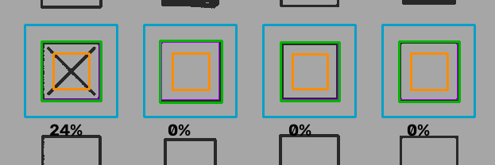

# 8. Leitura das marcações

Com a folha alinhada (capítulo 6) e a máscara de tinta pronta (capítulo 7), falta responder, para cada um dos 32
quadrados: **está marcado?** Depois aplicamos as regras de cada questão.

## Teoria

### 8.1 Contornos

Um **contorno** é a lista de pixels da **borda** de uma região branca numa imagem binária. O OpenCV encontra contornos
com o algoritmo de *border following* de **Suzuki e Abe (1985)**: percorre a imagem e, ao encontrar a borda de uma
região, "caminha" por ela até voltar ao início.

Opções usadas:
- `RETR_EXTERNAL`: devolve **só os contornos mais externos**. Um quadrado com um X dentro gera um contorno (o do
  quadrado); o X, que está dentro, é ignorado.
- `cv2.boundingRect(contorno)`: o **menor retângulo alinhado aos eixos** que contém o contorno. Com ele obtemos
  posição e tamanho do quadrado impresso.

### 8.2 Medir por proporção, não por contagem absoluta

"Quantos pixels de tinta há no quadrado?" depende do tamanho do quadrado. "**Que fração** do quadrado tem tinta?"
não depende. Por isso medimos:

```
preenchimento = pixels de tinta na região ÷ total de pixels da região
```

Um número entre 0 (vazio) e 1 (totalmente pintado).

### 8.3 Decisão com zona de dúvida

Um classificador com um único limite ("acima de 50% = marcado") força uma decisão mesmo quando o caso é ambíguo: um X
forte pode passar do limite e virar "resposta", e um preenchimento fraco pode sumir. Uma técnica comum é criar uma
**opção de rejeição**: além de "sim" e "não", existe "**não tenho certeza**". Quando a decisão errada é cara (dar ou
tirar ponto de um aluno), é melhor sinalizar do que chutar.

## Como aplicamos

### 8.4 Passo 1: achar o quadrado real (refinamento local)

A homografia coloca a folha no lugar, mas a **impressão** pode ter pequenas variações: um quadrado um pouco deslocado
ou de tamanho diferente. Então, em vez de confiar cegamente na posição do `layout.py`, **procuramos o quadrado de
verdade perto dela**:

```python
def localizar_quadrado(mascara, esperado):
    janela = esperado.expandir(layout.FOLGA_BUSCA)        # 30% maior de cada lado
    recorte = mascara[janela.y : janela.y + janela.h, janela.x : janela.x + janela.w]
    contornos, _ = cv2.findContours(recorte, cv2.RETR_EXTERNAL, cv2.CHAIN_APPROX_SIMPLE)
    melhor = esperado                                     # plano B: posição do template
    for contorno in contornos:
        x, y, w, h = cv2.boundingRect(contorno)
        if not (0.75 <= w / esperado.w <= 1.30 and 0.75 <= h / esperado.h <= 1.30):
            continue                                      # tamanho incompatível com um quadrado
        # ... fica com o candidato cujo centro está mais perto do esperado
    return melhor
```

| Regra | Valor | Por quê |
|---|---|---|
| Janela de busca | +30% por lado (72 → 116 px) | Cobre desalinhamentos de impressão sem invadir o quadrado vizinho (garantido pelo teste de layout) |
| Tamanho aceito | 75% a 130% do esperado | Aceita impressões com escala diferente; rejeita pedaços de texto ou rabiscos grandes |
| Critério de escolha | Centro mais próximo | Se houver mais de um candidato, o mais provável é o que está onde deveria |
| Plano B | Posição do template | Se nada plausível for encontrado (ex.: rabisco enorme borrou tudo), ainda medimos no lugar esperado |

### 8.5 Passo 2: medir só a parte de dentro

A **borda impressa** do quadrado também é preta e apareceria na máscara como tinta. Por isso encolhemos o quadrado
**20% de cada lado** e medimos só no miolo:

```
 ┌──────── 72 px ────────┐
 │ ░░░░░░░░░░░░░░░░░░░░░ │   ░ = margem ignorada (14 px de cada lado)
 │ ░░┌──── 44 px ────┐░░ │
 │ ░░│               │░░ │   região interna: 44 × 44 = 1936 pixels
 │ ░░│   medimos     │░░ │
 │ ░░│   aqui        │░░ │
 │ ░░└───────────────┘░░ │
 │ ░░░░░░░░░░░░░░░░░░░░░ │
 └───────────────────────┘
```

```python
def medir_preenchimento(mascara, quadrado):
    interno = quadrado.encolher(0.20)
    regiao = mascara[interno.y : interno.y + interno.h, interno.x : interno.x + interno.w]
    return np.count_nonzero(regiao) / regiao.size
```

Exemplo: se 1.000 dos 1.936 pixels internos forem tinta, o preenchimento é 1000 ÷ 1936 ≈ **52%**.

**Por que isso torna o sistema tolerante a quadrados de tamanhos diferentes?** Mesmo que o refinamento falhe e usemos
a posição do template, a região interna (44 px) fica **dentro** de quadrados impressos entre 85% e 115% do tamanho:
- quadrado a 85%: lado ≈ 61 px, borda a ±30 px do centro; a região interna vai só até ±22 px ✓
- quadrado a 115%: lado ≈ 83 px, com ainda mais folga ✓



*Questão 5 da foto de exemplo. **Azul**: janela de busca. **Verde**: quadrado encontrado. **Laranja**: região interna
medida. Na alternativa A (X desenhado), 24% da região interna é tinta; nas outras, 0%.*

### 8.6 Passo 3: classificar cada quadrado

```python
LIMITE_VAZIO = 0.15
LIMITE_MARCADO = 0.50
```

| Preenchimento | Estado | Exemplos reais medidos |
|---|---|---|
| ≤ 15% | **vazio** | quadrados em branco: 0% |
| entre 15% e 50% | **dúvida** | X: **24%** · só um terço pintado: **33%** |
| ≥ 50% | **marcado** | quadrado todo pintado (preto ou azul): **100%** |

Por que esses valores?
- **15%**: bem acima de um quadrado vazio (0% nas fotos de teste, porque a borda impressa fica fora da região
  interna), mas abaixo de um X feito com caneta de espessura normal (24% no teste). Com fotos reais, vale conferir
  esses números no `avaliar.py`.
- **50%**: um preenchimento "de verdade" cobre quase todo o miolo; exigir pelo menos metade dá margem para
  preenchimentos imperfeitos.
- Os dois ficam em constantes no topo de `marcacoes.py`, fáceis de ajustar depois de testar com folhas reais.
- `LIMITE_MARCADO` também pode ser ajustado **sem mexer no código**: o expander "Ajustes avançados" do app tem um
  slider que passa esse valor para `ler_folha(..., limite_marcado=...)`, usado tanto no gabarito oficial quanto na
  folha do aluno (ver capítulo 10.1). `LIMITE_VAZIO` continua fixo em 0.15.

### 8.7 Passo 4: regras de cada questão

```python
def status_questao(estados):
    marcados = [i for i, e in enumerate(estados) if e is EstadoCelula.MARCADO]
    duvidas = sum(e is EstadoCelula.DUVIDA for e in estados)
    if len(marcados) >= 2:
        return StatusQuestao.ANULADA_MULTIPLA, None
    if duvidas:
        return StatusQuestao.ANULADA_AMBIGUA, None
    if marcados:
        return StatusQuestao.RESPONDIDA, ALTERNATIVAS[marcados[0]]
    return StatusQuestao.EM_BRANCO, None
```

| O que tem na linha A–D | Resultado | Vale ponto? |
|---|---|---|
| exatamente 1 marcado, nenhuma dúvida | **respondida** (a letra) | se for igual à oficial |
| nada marcado, nenhuma dúvida | **em branco** | não |
| 2 ou mais marcados | **anulada: marcou mais de uma** | não |
| alguma dúvida (com 0 ou 1 marcado) | **anulada: marcação incompleta** | não |

**A ordem das regras importa.** "Marcação múltipla" é testada antes de "dúvida" porque é a explicação mais forte: se
o aluno pintou A e C inteiros, o motivo principal é ter marcado duas, mesmo que também haja um rabisco em B.

**Decisão do grupo:** uma dúvida **anula** a questão mesmo que outra alternativa esteja bem pintada. Exemplo: A
pintado e um X em C. Não dá para saber se o X foi uma "desmarcação" ou uma segunda resposta; na dúvida, anula.


*Resultado final na foto de exemplo: verde = marcado, laranja = dúvida, cinza = vazio, com o % de cada quadrado.*

### 8.8 Limitações conhecidas

| Situação | O que acontece |
|---|---|
| X ou tique muito fino | Pode ficar abaixo de 15% e ser lido como **em branco** em vez de anulado |
| Lápis ou caneta muito clara | Pode não entrar na máscara de tinta; lido como em branco |
| Rabisco **fora** do quadrado | Não é contado (só medimos dentro) |
| Corretivo branco em cima de uma marcação | Funciona: o corretivo é claro e vira "papel" |
