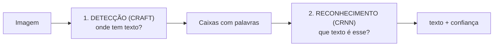

# 9. OCR: lendo Nome, CPF e RG

**OCR** (*Optical Character Recognition*, reconhecimento óptico de caracteres) é transformar a **imagem** de um texto em
**texto** de verdade (uma *string*). Das etapas do projeto, é a única que usa **aprendizado de máquina**: todo o resto
(capítulos 5 a 8) são regras e contas que escrevemos.

## Teoria

### 9.1 Por que texto escrito à mão é difícil

Em um **quadrado de resposta** a pergunta é simples: "tem tinta ou não?". Uma letra é muito mais variada:

| Dificuldade | Exemplo |
|---|---|
| Cada pessoa escreve de um jeito | O "a" de duas pessoas pode não se parecer em nada |
| Letras parecidas | `O` × `0`, `I` × `l` × `1`, `S` × `5`, `B` × `8` |
| **Cursiva: letras emendadas** | Em "Maria" cursiva, onde termina o "a" e começa o "r"? O computador não tem como "recortar" letra por letra |
| Tamanho e inclinação variam | Mesmo dentro de uma palavra |

Por isso não dá para resolver com regras escritas à mão ("se tem uma barra vertical e um arco, é um P…"). A solução
moderna é **treinar uma rede neural** com milhões de exemplos de texto.

### 9.2 Ponte com a aula de filtros: redes convolucionais

Na aula de filtros aplicamos **convolução** com máscaras **escolhidas por nós** (média, Sobel, Laplaciano) para
realçar bordas e texturas. Uma **rede neural convolucional (CNN)** faz a mesma operação, só que os **valores das
máscaras são aprendidos** durante o treino. As primeiras camadas aprendem detectores de bordas e traços; as
seguintes combinam traços em curvas e partes de letras.

### 9.3 Como o EasyOCR funciona

O EasyOCR trabalha em **duas etapas**, cada uma com uma rede neural:



**1. Detecção: CRAFT** (*Character Region Awareness For Text detection*). A rede olha a imagem inteira e produz, para
cada pixel, duas "notas":
- **região**: o quanto aquele pixel parece estar **no meio de uma letra**;
- **afinidade**: o quanto parece estar **entre duas letras da mesma palavra**.

Juntando as áreas com notas altas, saem as **caixas** de cada palavra ou trecho.

**2. Reconhecimento: CRNN** (rede convolucional + recorrente). Para cada caixa:

```
 imagem da palavra ─► CNN (ResNet/VGG) ─► sequência de "fatias" ─► LSTM ─► letra provável por fatia ─► CTC ─► texto
```

1. A **CNN** extrai características da imagem e a transforma numa **sequência de fatias verticais**, da esquerda para a
   direita.
2. A **LSTM** (rede recorrente) lê essa sequência **considerando o contexto**, ou seja, o que veio antes e depois. Isso
   ajuda a desempatar: num nome, depois de "MAR" é mais provável "I" que "1".
3. Para cada fatia, a rede dá uma **probabilidade para cada caractere possível**, mais um símbolo especial "vazio" (−).
4. A decodificação **CTC** (*Connectionist Temporal Classification*) transforma a sequência de fatias em texto:
   **junta repetições seguidas** e **remove os vazios**:

```
 fatias:   M M − A A − R − I I − A −
 junta:    M   − A   − R − I   − A −
 remove:   M     A     R   I     A
 texto:    "MARIA"
```

É isso que permite ler uma palavra **sem saber onde cada letra começa e termina**: a rede não precisa recortar as
letras, só dizer "o que aparece" em cada fatia.

**Confiança:** o EasyOCR calcula, a partir das probabilidades que a rede deu aos caracteres escolhidos, um número de
0 a 1 para cada trecho. **Não é garantia de acerto**: é o quanto a rede "tinha certeza".

### 9.4 Por que a cursiva continua difícil

O modelo do EasyOCR foi treinado **principalmente com texto impresso** (placas, documentos, textos gerados por
computador). Letra de forma manuscrita ainda se parece com texto impresso; **cursiva, em geral, não**. Por isso a
expectativa, anotada desde o início do projeto, é: **letra de forma razoável, cursiva provavelmente ruim**.

Existem modelos treinados especificamente para manuscrito (como o TrOCR) e modelos de IA de visão (os mesmos por trás
de assistentes como o Claude) que leem cursiva muito melhor. **O grupo escolheu o EasyOCR de propósito**: roda no
computador, sem internet e sem custo, e deixa a limitação visível para a parte "o que não deu certo" da apresentação.

## Como aplicamos

### 9.5 O código (`gabarito/ocr.py`)

```python
def recortar_campo(folha_bgr, campo):
    m = 8                                                     # descarta a borda da caixa
    recorte = folha_bgr[campo.y + m : campo.y + campo.h - m, campo.x + m : campo.x + campo.w - m]
    cinza = cv2.cvtColor(recorte, cv2.COLOR_BGR2GRAY)
    return cv2.resize(cinza, None, fx=2, fy=2, interpolation=cv2.INTER_CUBIC)   # amplia 2×

class LeitorOCR:
    def __call__(self, folha_bgr):
        return Identificacao(
            nome=self._ler(folha_bgr, layout.CAMPO_NOME),
            cpf=self._ler(folha_bgr, layout.CAMPO_CPF, allowlist="0123456789.-"),
            rg=self._ler(folha_bgr, layout.CAMPO_RG, allowlist="0123456789.-Xx"),
        )
```

| Decisão | Por quê |
|---|---|
| **Recortar da folha alinhada** | Como a folha já foi endireitada, a caixa do Nome está sempre no mesmo lugar (`layout.CAMPO_NOME`). O OCR recebe só o que interessa |
| **Descartar 8 px da borda** | A linha da caixa poderia ser lida como "I" ou "l" |
| **Ampliar 2× (bicúbica)** | Na folha padrão, a letra tem ~40 px de altura. Ampliar deixa os traços mais "grossos" para a rede, que ignora elementos muito pequenos |
| **Allowlist no CPF/RG** | Restringe os caracteres que a rede pode devolver: um `O` vira `0`, um `l` vira `1`. O "X" do RG é permitido (dígito verificador) |
| **Nome sem allowlist** | Nomes têm acentos e muitas letras |
| **Juntar os pedaços** | O EasyOCR pode devolver "MARIA" e "SILVA" como caixas separadas; ordenamos pela posição x e juntamos com espaço. A confiança do campo é a **média** dos pedaços |
| **Modelo carregado uma vez só** | Carregar a rede leva vários segundos. O `LeitorOCR` carrega no primeiro uso e o app guarda o objeto com `st.cache_resource` |
| **Falha no OCR não bloqueia a nota** | `ler_folha` captura qualquer erro do OCR e só mostra um aviso |

### 9.6 Como o app mostra a confiança

| Confiança média | Selo no app |
|---|---|
| ≥ 0,70 | confiança alta (verde) |
| 0,40 a 0,69 | confiança média (laranja) |
| < 0,40 | confiança baixa (vermelho) |
| nada lido | "Não lido" |

### 9.7 Resultados até agora

| Teste | Resultado | Vale como prova? |
|---|---|---|
| Fotos sintéticas, texto em Arial (parecido com letra de forma) | 100% dos campos corretos | Mostra que o **pipeline** funciona (recorte, allowlist, junção) |
| Fotos sintéticas, texto em Segoe Script ("cursiva" de computador) | 100% dos campos corretos | ⚠️ **Não**: é uma fonte digital, regular demais. Letra cursiva de verdade é muito mais difícil |
| **Fotos reais** (letra de mão) | *a medir: ver [resultados.md](resultados.md)* | ✅ Esta é a avaliação que conta |
