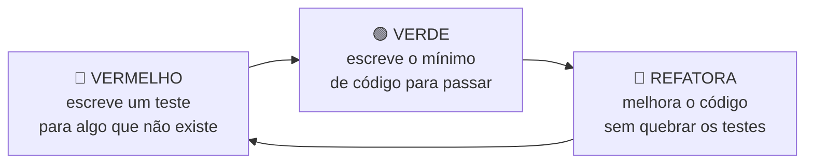

# 11. Testes e validação

"Funcionou quando eu testei" não é prova. Este capítulo explica **como sabemos** que o software funciona e, tão
importante quanto, **o que ainda não foi provado**.

## 11.1 TDD: o teste vem antes do código

O projeto foi escrito com **TDD** (*Test-Driven Development*), num ciclo de três passos:



**Por que escrever o teste antes?** Um teste escrito depois do código tende a testar "o que o código faz", e não "o
que ele deveria fazer". Ver o teste **falhar primeiro** prova que ele realmente detecta a ausência da funcionalidade.

Exemplo real do projeto: o suporte a PDF.
1. 🔴 Escrevemos `test_carregar_pdf_renderiza_a_pagina_e_os_marcadores_sao_encontrados` e rodamos: **falhou** com
   "Não consegui abrir o arquivo como imagem".
2. 🟢 Implementamos `_renderizar_pdf` com o `pypdfium2`: **passou**.
3. Rodamos a suíte inteira para garantir que nada mais quebrou.

## 11.2 O que é testado

```powershell
.\.venv\Scripts\python.exe -m pytest          # 88 testes, ~10 s
.\.venv\Scripts\python.exe -m pytest -m ocr   # +1 teste com o EasyOCR de verdade
```

| Arquivo | Testes | O que garante |
|---|---|---|
| `test_layout.py` | 9 | Quadrados dentro da página, janelas de busca sem sobreposição, nada na zona de silêncio dos marcadores |
| `test_folha.py` | 6 | A folha gerada tem tamanho A4 e os 4 ArUco são detectados **na posição exata do layout** |
| `test_alinhamento.py` | 8 | Orientação EXIF, arquivo inválido, **PDF** (inclusive com várias páginas e corrompido), folha de cabeça para baixo, erro que nomeia os cantos faltando |
| `test_marcacoes.py` | 20 | Faixas vazio/dúvida/marcado, todas as regras de anulação, caneta azul, sombra forte, papel liso sem tinta, quadrados impressos a 85% e 115%, quadrado deslocado |
| `test_leitura.py` | 16 | **Fotos sintéticas de ponta a ponta** em 10 cenários, 3 variações de tamanho de impressão, PDF, e o OCR falhando sem derrubar a correção |
| `test_correcao.py` | 10 | JSON válido/inválido, folha-mestre com problemas, contagem de certas/erradas/brancos/anuladas |
| `test_ocr.py` | 10 | Recorte sem a borda, junção de pedaços, níveis de confiança (+1 teste com o modelo real) |
| `test_interface_html.py` | 8 | Placar, resumo, classe de cada linha, bolinhas oficial/aluno, escape de HTML |
| `test_visualizacao.py` | 2 | Cores da grade detectada |

## 11.3 Fotos sintéticas: como testar sem imprimir 500 folhas

Para testar "foto torta, com sombra, de cabeça para baixo" precisaríamos de muitas fotos reais, **com resposta
conhecida**. A solução foi **simular** essas fotos (`gabarito/sintetico.py`).

### Passo 1: preencher a folha no computador (`folha_preenchida`)

Desenha marcações na folha gerada:

| Tipo | Como é desenhado |
|---|---|
| `cheio` | Polígono com cantos irregulares + zigue-zague de "caneta" (imita preenchimento à mão) |
| `x` | Duas diagonais |
| `traco` | Uma linha horizontal |
| `parcial` | Só a parte esquerda do quadrado (~1/3 da região medida) |

Também pode **redesenhar os quadrados com tamanhos aleatórios** (ex.: entre 85% e 115%), simulando impressão torta,
e escrever Nome/CPF/RG com uma fonte.

### Passo 2: "fotografar" (`fotografar`)

Cada efeito imita um problema real, **usando as técnicas dos capítulos anteriores ao contrário**:

| Efeito | Como é simulado | Problema real que imita |
|---|---|---|
| Escala | `cv2.resize` com `INTER_AREA` | Distância da câmera |
| Perspectiva | Desloca os 4 cantos aleatoriamente e aplica uma **homografia** | Celular inclinado |
| Rotação | Gira os cantos com uma matriz de rotação | Folha torta na mesa |
| Fundo | `borderValue` marrom-escuro no `warpPerspective` | Mesa |
| Sombra | Multiplica por um degradê linear (de 1 até 1 − intensidade) | Mão ou corpo fazendo sombra |
| Desfoque | Filtro gaussiano | Foco ruim, tremida |
| Ruído | Soma ruído gaussiano | Sensor de celular com pouca luz |
| JPEG | Codifica e decodifica com qualidade 88 | Compressão da câmera |

### Os cenários testados

| Cenário | Parâmetros |
|---|---|
| reta | nenhum efeito além da escala |
| girada 5° / girada 30° | rotação |
| de cabeça para baixo | rotação de 180° |
| perspectiva | cantos deslocados até 8% da largura |
| sombra | degradê até 50% |
| **sombra forte** | degradê até 75% + rotação + perspectiva |
| desfocada e ruidosa | desfoque σ = 1,5 + ruído |
| pequena na foto | folha ocupando pouco da imagem (escala 0,35) |
| tudo junto | rotação, perspectiva, sombra, desfoque e ruído ao mesmo tempo |

Em todos, as 8 questões precisam ser lidas **exatamente** como esperado: 5 respondidas (preto e azul), 1 marcação
dupla, 1 X, 1 em branco e 1 parcial.

## 11.4 Experimentos: provando que cada parte é necessária

Um bom jeito de entender (e de mostrar que se entendeu) é **desligar uma parte do algoritmo e ver o que quebra**. O
script `scripts/experimentos.py` faz isso **sem alterar nenhum arquivo**:

```powershell
.\.venv\Scripts\python.exe scripts\experimentos.py                  # lista os experimentos
.\.venv\Scripts\python.exe scripts\experimentos.py sem_refinamento  # roda um
```

Resultados verificados:

| Experimento | O que desliga | O que quebra | Lição |
|---|---|---|---|
| `sem_refinamento` | Procurar o quadrado real | `test_refinamento_acompanha_quadrado_deslocado` | Sem refinamento, um quadrado impresso fora do lugar é medido pela metade |
| `sem_margem_interna` | Ignorar a borda do quadrado | **20 testes**, inclusive a folha em branco | A borda impressa conta como tinta: quadrados vazios parecem "em dúvida" |
| `limite_vazio_30` | Sobe o limite de vazio para 30% | **16 testes** | O X (24%) passa a ser lido como em branco, e a questão deixa de ser anulada |
| `sem_dilatacao` | A dilatação na estimativa do fundo | 3 testes com quadrados pintados | Sem dilatação, o "fundo" inclui a própria tinta; quadrado pintado ÷ fundo escuro = claro, e a marcação **some** |
| `sem_trava_do_limiar` | Prender o Otsu entre 100 e 200 | `test_papel_liso_com_ruido_nao_vira_tinta` | Numa região sem tinta, o Otsu separa ruído de papel e inventa tinta |
| `otsu_direto` | Toda a compensação de sombra | Cenário **sombra forte** + 2 testes de sombra/papel | Uma sombra forte vira "tinta" (figura 9 do capítulo 7) |

> **Transparência:** dois desses testes (papel liso e sombra forte) foram **adicionados enquanto escrevíamos esta
> documentação**. Ao rodar os experimentos, percebemos que desligar a trava do limiar não quebrava nenhum teste, e que
> o teste de sombra antigo usava uma sombra fraca demais para exigir a compensação. Ou seja, essas partes do código
> funcionavam, mas **não estavam protegidas**. Rodar experimentos assim é uma boa forma de achar buracos nos testes.

## 11.5 Teste manual no navegador

Além do pytest, o app foi usado de verdade num navegador automatizado (Playwright), verificando:
- gabarito por foto, por JSON e por PDF;
- folha-mestre inválida (mensagem com as questões a conferir);
- alunos com anuladas, com erros, de cabeça para baixo, em PDF;
- botão "Corrigir outra folha";
- tela em largura de celular (400 px), sem rolagem horizontal;
- console do navegador sem erros.

Problemas encontrados **só** nesse teste manual, e corrigidos:
- a lista de questões aparecia deslocada para a direita (o CSS do Streamlit aplicava um recuo em listas);
- em questões anuladas, não dava para ver qual era a resposta oficial (a cor laranja cobria o contorno);
- depois de mudar o código, o app continuava rodando a versão antiga (é preciso reiniciar o Streamlit).

## 11.6 Avaliação com amostras (`scripts/avaliar.py`)

Roda o pipeline completo, **com OCR**, em todas as imagens de uma pasta e compara com o `.json` esperado de cada uma:

```powershell
.\.venv\Scripts\python.exe scripts\avaliar.py amostras\sinteticas
```

Resultado nas amostras sintéticas: **48/48 respostas** e **15/15 campos de OCR** corretos (5 fotos + 1 PDF).

## 11.7 O que **ainda não** foi provado

| Não provado | Por quê | Como provar |
|---|---|---|
| Funciona com **fotos reais de celular** | Toda a validação automática usa fotos simuladas | Fotografar folhas reais e rodar o `avaliar.py` em `amostras/reais/` |
| OCR em **letra de mão real**, principalmente cursiva | Os testes usam fontes de computador | Idem, com nomes escritos à mão |
| Limites de 15% e 50% ideais para canetas reais | Escolhidos por raciocínio e fotos sintéticas | Olhar os % na grade detectada das fotos reais e ajustar se preciso |
| Marcação muito fraca, lápis, papel amassado | Não simulados | Testar e registrar em [resultados.md](resultados.md) |
