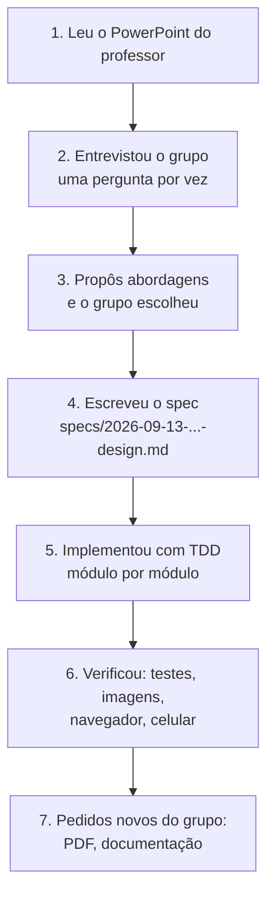

# 12. Como a IA foi usada

O professor liberou o uso de IA, com uma condição: **o grupo precisa entender o que a IA fez**. Este capítulo registra,
com honestidade, **quem decidiu o quê**, **o que a IA produziu** e **como conferir**.

## 12.1 Ferramenta

- **Claude Code** (assistente de programação da Anthropic, modelo Claude Opus 5), rodando no terminal, com acesso à
  pasta do projeto.
- A IA consultou a **documentação atual** das bibliotecas (OpenCV, Streamlit, EasyOCR, pypdfium2) antes de usá-las, em
  vez de confiar só na memória. Isso importou: por exemplo, o pip instalou o **OpenCV 5.0**, e foi preciso confirmar
  que a API de ArUco continuava igual.
- Para testar a interface, a IA controlou um navegador automatizado (**Playwright**), enviando arquivos e tirando
  capturas de tela.

## 12.2 O processo, em ordem

### 1. Leitura do enunciado
Um `.pptx` é um arquivo ZIP com XMLs dentro. A IA extraiu o texto dos slides e as imagens (as duas folhas de exemplo
preenchidas com rabiscos azul e preto) para entender o problema.

### 2 e 3. Entrevista e decisões

A IA fez perguntas de múltipla escolha, sempre indicando uma recomendação. **Várias decisões foram diferentes da
recomendação da IA**, e isso é importante registrar:

| Pergunta | Recomendação da IA | **Decisão do grupo** |
|---|---|---|
| Linguagem | Python + OpenCV (mais documentação para OMR, OCR de manuscrito, gratuito) | Aceitou Python + OpenCV |
| Como a imagem chega | — | **Foto de celular (arquivo)**; depois o grupo pediu também **PDF** |
| Gabarito oficial | Foto de uma folha-mestre | **Folha-mestre OU arquivo JSON** |
| OCR do nome | IA de visão via API (melhor em cursiva) | **Tesseract/EasyOCR** (local; a IA escolheu o EasyOCR entre os dois por instalar só com pip) |
| CPF e RG | — | **OCR, como o nome** |
| Interface | App web local (Streamlit) | Streamlit, **com fluxo simplificado**: gabarito mestre → aluno → nota |
| Marcação fraca | 3 faixas (vazio/dúvida/marcado) | Aceitou |
| Folha | Gerada por código | Aceitou |
| Localizar a folha | Marcadores ArUco (abordagem A) | Aceitou (contra B: quadrados pretos, e C: sem marcadores) |
| Regras | Anulada vale 0; dúvida anula | Aprovou |
| Visual | — | **Estilo Apple**, pedido pelo grupo |

Depois, o grupo testou a **folha original do professor** (sem marcadores) e ela foi recusada. A IA propôs um segundo
modo de leitura, sem marcadores, para prints; **o grupo decidiu não fazer** e usar a folha do software.

### 4. Spec
Antes de programar, a IA escreveu o documento de design com todas as decisões, arquitetura, regras e testes planejados:
[`specs/2026-09-13-corretor-gabarito-design.md`](../specs/2026-09-13-corretor-gabarito-design.md).

### 5. Implementação
Na ordem: `layout` → `folha` → `marcacoes` → `alinhamento` + `sintetico` + `leitura` → `correcao` → `ocr` →
`visualizacao` → `interface_html` → `app.py` → scripts → PDF → documentação. Cada módulo seguiu o ciclo TDD do
[capítulo 11](11-testes.md).

### 6. Problemas encontrados no caminho

Uma IA também erra. O que importa é o processo pegar os erros. Os que apareceram:

| Problema | Como foi percebido | Correção |
|---|---|---|
| As janelas de busca de linhas vizinhas se sobrepunham | Teste de layout falhou | Aumentou o passo entre linhas |
| A moldura da grade e o rodapé encostavam no marcador inferior direito, que deixou de ser detectado | Teste da folha falhou | Novo layout + teste da "zona de silêncio" |
| A marcação sintética "metade" daria exatamente 50%, a fronteira entre dúvida e marcado | Conta feita antes de rodar o teste | Trocada por "parcial" (~33%) |
| `warpPerspective` não aceita `INTER_AREA` | Revisão do código | Superamostragem: gerar 2× e reduzir |
| `opencv-python` e o EasyOCR (que usa `opencv-python-headless`) conflitam | Conhecimento prévio, antes de instalar | Só o `headless` no `requirements.txt` |
| Lista de questões deslocada na tela | Captura de tela no navegador | CSS mais específico |
| Resposta oficial invisível em questões anuladas | Captura de tela | Anel escuro em volta da bolinha |
| App rodando código velho depois da mudança para PDF | Mensagem de erro antiga no navegador | Reiniciar o servidor (documentado) |
| A trava do limiar e a compensação de sombra não eram realmente testadas | Experimentos de "desligar partes" | Dois testes novos |
| OCR 100% nas amostras poderia ser mal interpretado | Análise dos dados | Aviso explícito: fontes de computador não são letra de mão |

## 12.3 O que é do grupo (e não da IA)

- **As decisões** da tabela acima.
- **Os testes com folhas reais**, fotos e o preenchimento de [resultados.md](resultados.md). A IA não tem como
  fotografar papel.
- **A apresentação**: explicar o funcionamento com as próprias palavras.

## 12.4 Como conferir que o grupo entendeu

Um roteiro prático, do mais simples ao mais profundo:

1. **Rodar tudo:** app, testes e `gerar_amostras.py` ([capítulo 1](01-como-executar.md)).
2. **Explicar a figura de cada etapa** em [02-visao-geral.md](02-visao-geral.md) sem ler o texto.
3. **Refazer as contas à mão:**
   - a posição de `celula(5, "B")` (capítulo 4);
   - o Otsu do exemplo de 10 pixels (capítulo 7);
   - o preenchimento de 1000 pixels de tinta num miolo de 44 × 44 (capítulo 8).
4. **Rodar os experimentos** do capítulo 11 e explicar **por que** cada teste quebrou.
5. **Mudar um parâmetro de propósito** (por exemplo `LIMITE_MARCADO = 0.8` em `gabarito/marcacoes.py`), rodar o app com
   uma foto e explicar o que mudou na grade detectada. Depois, desfazer a mudança.
6. **Responder** as [perguntas e respostas](13-perguntas-e-respostas.md) sem olhar.

## 12.5 Mapa: conceito da disciplina → onde está no código

| Conceito visto em aula | Onde aparece |
|---|---|
| Imagem como matriz, canais RGB | `carregar_imagem`, `etapas_mascara` (`folha_bgr.min(axis=2)`) |
| Conversão para tons de cinza | `alinhar` (detecção ArUco), `recortar_campo` (OCR) |
| Limiarização / binarização | `etapas_mascara` (Otsu) |
| Filtro gaussiano (suavização) | `etapas_mascara` (fundo), `sintetico.fotografar` (desfoque) |
| Convolução | Filtro gaussiano; as CNNs do EasyOCR (capítulo 9) |
| Morfologia (dilatação) | `etapas_mascara` (estimativa do fundo) |
| Ruído | `sintetico.fotografar` (ruído gaussiano); robustez testada |
| Transformações geométricas | `alinhar` (homografia), `sintetico.fotografar` (rotação, perspectiva) |
| Interpolação | `warpPerspective` (bilinear), `resize` (área e bicúbica) |
| Segmentação e contornos | `localizar_quadrado` (`findContours`, `boundingRect`) |

## 12.6 Sessão de acompanhamento (depois da primeira entrega)

Depois da implementação inicial, o grupo pediu ajustes de UX usando o **Claude Code** dentro do próprio terminal (não
mais só a entrevista inicial). Registro dos pedidos e do que foi feito:

| Pedido do grupo | O que foi feito |
|---|---|
| Rodar o projeto num Mac (o guia só tinha Windows) | Instalado Python 3.12 via Homebrew (a `.venv` do projeto pede essa versão) |
| Um comando único para subir o app, tipo `npm run dev` | Script `run.sh` |
| Marcação fraca (X) sendo anulada por ficar abaixo de 50% de tinta | `limite_marcado` virou parâmetro opcional em `classificar`, `ler_marcacoes` e `ler_folha` (valor padrão preservado, testes não mudaram) + slider "Ajustes avançados" no app |
| Ver a "grade detectada" também para o gabarito oficial (só aparecia em erro) | A leitura da folha-mestre passou a ficar em `st.session_state` (antes era descartada após o `st.rerun()`) |
| Informar o gabarito sem precisar de foto | Terceiro modo "Selecionar alternativas": 8 `st.segmented_control`, com pré-visualização gerada por `sintetico.folha_preenchida` |
| Grade de 4 colunas ficou ruim no celular | Reduzida para 3 colunas |
| Última linha (2 questões) não alinhava com as colunas de cima | O bug era usar `st.columns(2)` só nessa linha; a correção é sempre criar `st.columns(3)` e deixar a sobra vazia |

**Um problema à parte, não de código:** depois de editar `gabarito/leitura.py` com o app já aberto, o Streamlit deu
`TypeError: ler_folha() got an unexpected keyword argument`. Não era um bug da mudança — era o interpretador do app
ainda com o módulo antigo em memória (o próprio capítulo 1 já avisa disso). A correção foi reiniciar o processo do
zero, não mudar código.

**O que o grupo decidiu aqui:** manter "Selecionar alternativas" como padrão (mais rápido que foto), mas sem remover
as outras duas formas; e limitar o ajuste de sensibilidade a `LIMITE_MARCADO` (deixando `LIMITE_VAZIO` fixo), por ser
o limite que gera o problema mais comum em apresentação (marcação fraca sendo anulada).
