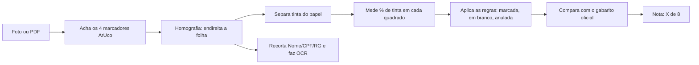

# Documentação do Corretor de Gabarito

Esta pasta explica **tudo** o que o software faz: primeiro a **teoria** de processamento de imagem por trás de cada
etapa, depois **como ela foi aplicada** no código, com os valores reais que usamos e o motivo de cada escolha.

A ideia é que qualquer pessoa do grupo consiga ler na ordem, entender e explicar para a turma, inclusive a parte que
foi feita com ajuda de IA.

> 📘 **Versão para estudo em PDF:** [apostila.pdf](apostila.pdf) reúne todos os capítulos, com capa, sumário e apêndices. Para regerar depois de editar os .md: `.\.venv\Scripts\python.exe scripts\gerar_apostila.py`.

## Ordem de leitura

| # | Capítulo | O que você vai entender |
|---|---|---|
| 1 | [Como executar](01-como-executar.md) | Instalar, abrir o app, imprimir a folha, resolver problemas comuns |
| 2 | [Visão geral](02-visao-geral.md) | O problema, o caminho completo da foto até a nota, o mapa do código |
| 3 | [Imagem digital](03-imagem-digital.md) | Pixel, matriz, canais de cor, resolução (DPI), coordenadas |
| 4 | [A folha de respostas](04-a-folha.md) | Por que desenhamos nossa própria folha e como ela foi pensada |
| 5 | [Marcadores ArUco](05-marcadores-aruco.md) | Como o programa acha os 4 cantos da folha na foto |
| 6 | [Homografia](06-homografia.md) | Como uma foto torta vira uma folha "reta" |
| 7 | [Segmentação da tinta](07-segmentacao-da-tinta.md) | Separar tinta de papel: canal mínimo, sombra, morfologia, Otsu |
| 8 | [Leitura das marcações](08-leitura-das-marcacoes.md) | Contornos, % de preenchimento e as regras de anulação |
| 9 | [OCR do nome, CPF e RG](09-ocr.md) | Como uma rede neural lê texto e por que a cursiva é difícil |
| 10 | [Correção e interface](10-correcao-e-interface.md) | Gabarito oficial, nota, e como o app Streamlit funciona |
| 11 | [Testes e validação](11-testes.md) | Como provamos que funciona: TDD e fotos sintéticas |
| 12 | [Como a IA foi usada](12-uso-de-ia.md) | O que a IA fez, o que o grupo decidiu e como conferir |
| 13 | [Perguntas e respostas](13-perguntas-e-respostas.md) | Perguntas que o professor ou a turma podem fazer |

Material para a entrega:
- [Roteiro da apresentação](apresentacao.md)
- [Resultados: o que deu certo e o que não deu](resultados.md)

## Resumo em uma frase por etapa



## As figuras

Todas as imagens em [`img/`](img/) são geradas pelo script `scripts/gerar_figuras_docs.py` a partir de uma foto de
exemplo, usando **as mesmas funções do app**. Se alguém mudar o código, basta rodar o script de novo para atualizar
as figuras:

```powershell
.\.venv\Scripts\python.exe scripts\gerar_figuras_docs.py
```
