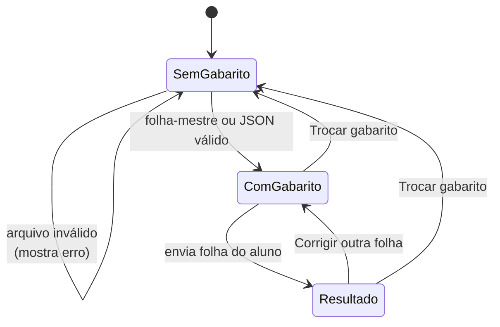

# 10. Correção e interface

Este capítulo tem pouca teoria de processamento de imagem. Ele explica como a **leitura** vira uma **nota** e como o
aplicativo web funciona.

## 10.1 O gabarito oficial

O gabarito oficial é, no fim, um dicionário simples: `{1: "A", 2: "C", ..., 8: "B"}`. Ele pode vir de dois lugares
(`gabarito/correcao.py`):

### Da foto/PDF de uma folha-mestre

A folha-mestre passa **pelo mesmo `ler_folha`** de uma folha de aluno. A diferença é a **validação**: todas as 8
questões precisam ter saído como **respondida**:

```python
def gabarito_de_leitura(leitura):
    problemas = [q.numero for q in leitura.questoes if q.status is not StatusQuestao.RESPONDIDA]
    if problemas:
        raise GabaritoInvalido(f"... Verifique as questões: {', '.join(map(str, problemas))}.", problemas)
    return {q.numero: q.letra for q in leitura.questoes}
```

**Por quê?** Se a folha-mestre tivesse uma questão em branco ou anulada, não saberíamos a resposta certa dela, e
corrigir **todos** os alunos com um gabarito errado é pior que recusar a folha-mestre.

### De um arquivo JSON

```json
{"1": "A", "2": "C", "3": "B", "4": "D", "5": "A", "6": "A", "7": "C", "8": "B"}
```

Validações feitas, cada uma com mensagem própria:

| Problema | Mensagem |
|---|---|
| Não é JSON | "O arquivo não é um JSON válido." |
| É uma lista em vez de objeto | "O JSON deve ser um objeto…" |
| Faltou questão | "Faltam as questões: 8." |
| Questão que não existe | "Questões que não existem na prova: 9." |
| Letra inválida | "Questão 3: resposta "E" inválida (use A, B, C ou D)." |

Letras minúsculas e espaços são aceitos (`" a "` vira `"A"`).

## 10.2 A nota

```python
def corrigir(oficial, aluno):
    linhas = tuple(
        LinhaResultado(
            numero=q.numero,
            oficial=oficial[q.numero],
            aluno=q,
            correta=q.status is StatusQuestao.RESPONDIDA and q.letra == oficial[q.numero],
        )
        for q in aluno.questoes
    )
    return Resultado(linhas)
```

A questão **só vale ponto** se foi respondida **e** a letra bate com a oficial. Em branco e anulada valem **zero**. A
anulação é da **resposta do aluno**, não da questão para a turma toda.

O `Resultado` calcula quatro contagens, que sempre somam 8: **certas**, **erradas**, **em branco** e **anuladas**.

## 10.3 Como o Streamlit funciona

O **Streamlit** transforma um script Python em página web. O modelo mental é diferente de um site comum e explica
várias decisões do `app.py`:

> **A cada clique ou upload, o Streamlit roda o `app.py` inteiro de novo, de cima para baixo.**

Isso traz três consequências:

**1. Variáveis comuns "esquecem" tudo a cada interação.** Para lembrar o gabarito oficial entre uma execução e outra,
ele fica em `st.session_state`, uma espécie de dicionário que sobrevive às reexecuções (enquanto a aba estiver aberta):

```python
estado = st.session_state
estado.setdefault("oficial", None)      # só define na primeira vez
...
estado.oficial = gabarito_de_leitura(leitura_mestre)
```

**2. Sem cuidado, a mesma foto seria processada a cada clique.** Por isso as leituras usam **cache**:

```python
@st.cache_data(show_spinner=False, max_entries=20)
def ler_aluno(dados: bytes):
    return ler_folha(carregar_imagem(dados), ocr=leitor_ocr())

@st.cache_resource(show_spinner=False)
def leitor_ocr():
    return LeitorOCR()
```

- `cache_data`: se os **bytes do arquivo** forem os mesmos, devolve o resultado guardado sem processar de novo.
- `cache_resource`: guarda **um único objeto** para o app todo; aqui, o modelo do OCR, que é pesado.

**3. Como "limpar" um campo de upload?** Um widget do Streamlit é identificado pela sua `key`. Para o botão
"Corrigir outra folha" esvaziar o upload, trocamos a chave:

```python
arquivo_aluno = st.file_uploader(..., key=f"aluno_{estado.versao_aluno}")
...
if st.button("Corrigir outra folha"):
    estado.versao_aluno += 1     # aluno_0 → aluno_1: é um widget novo, vazio
    st.rerun()
```

### O fluxo de telas



## 10.4 A tela de resultado

O resultado é um HTML gerado por `gabarito/interface_html.py` e estilizado por `estilo.css`:

- **Placar** grande: "6 de 8", e o resumo "6 certas, 1 errada, 1 anulada".
- **Identificação**: Nome, CPF e RG com o selo de confiança do OCR.
- **Réplica da folha**: 8 linhas com as bolinhas A–D:
  - **contorno escuro** = resposta oficial;
  - **bolinha preenchida** = marcada pelo aluno; **verde** se certa, **vermelha** se errada, **laranja** se anulada;
  - **listrada em laranja** = marcação em dúvida.
- **Ver processamento**: as abas *Grade detectada* (capítulo 8), *Folha alinhada* (capítulo 6) e *Arquivo original*.

Dois cuidados técnicos:
- **O HTML é gerado por uma função pura**, que recebe o `Resultado` e devolve texto, sem depender do Streamlit. Por
  isso ela tem testes automáticos (`tests/test_interface_html.py`).
- **Texto lido pelo OCR é "escapado"** (`html.escape`) antes de entrar no HTML. Se alguém escrevesse `<b>` no campo
  Nome e o OCR lesse isso, sem o escape o navegador interpretaria como código. É uma proteção padrão de segurança web
  (evita *injeção de HTML*).

## 10.5 A imagem "grade detectada"

`gabarito/visualizacao.py` desenha, em cima da folha alinhada, um retângulo em cada quadrado **na posição encontrada
pelo refinamento** (não na posição do template), com a cor do estado e o % de tinta:

```python
CORES_RGB = {
    EstadoCelula.MARCADO: (52, 199, 89),   # verde
    EstadoCelula.DUVIDA: (255, 159, 10),   # laranja
    EstadoCelula.VAZIO: (174, 174, 178),   # cinza
}
```

É a figura mais útil para **explicar um erro de leitura**: dá para ver exatamente o que o programa "achou" de cada
quadrado.

## 10.6 O visual

O grupo pediu um visual no estilo Apple: fundo cinza-claro `#F5F5F7`, grupos brancos com cantos arredondados, fonte do
sistema, bastante espaço em branco e cores de status do sistema da Apple (verde `#34C759`, vermelho `#FF3B30`,
laranja `#FF9F0A`). As mesmas cores são usadas na interface e na imagem da grade detectada, para as duas "falarem a
mesma língua".
